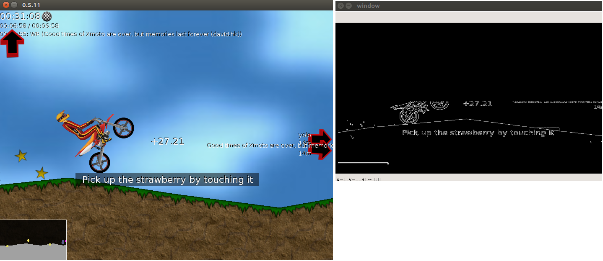

# Xmoto GODLIKE AI


# Actions
 - W = ADVANCE
 - A = LIFT FRONT WHEEL
 - S = BRAKE
 - D = LIFT BACK WHEEL

  # States
  - Dead = Detect when dead screen ?
  - Win = Detect win screen

  # Observations
   - Get the map lines

   

  # After updating pip package
  python3 setup.py sdist bdist_wheel
  then pip install -e .

  # Usage

  ```

  import gym
  import gym_xmoto

  env = gym.make('Xmoto-v0')

  ```


# TODO
 - Get velocity, position ?
 - find a way to positive reward
 - implement DQN
